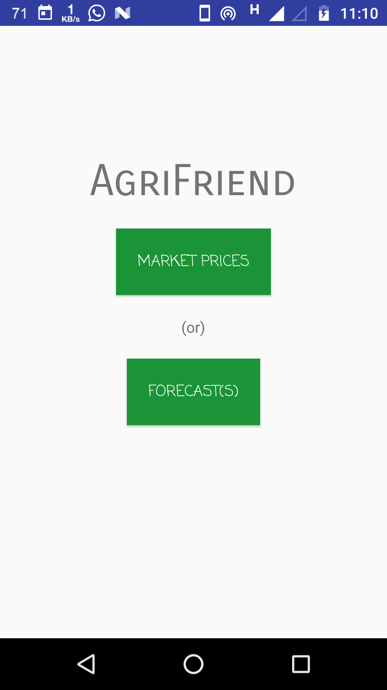
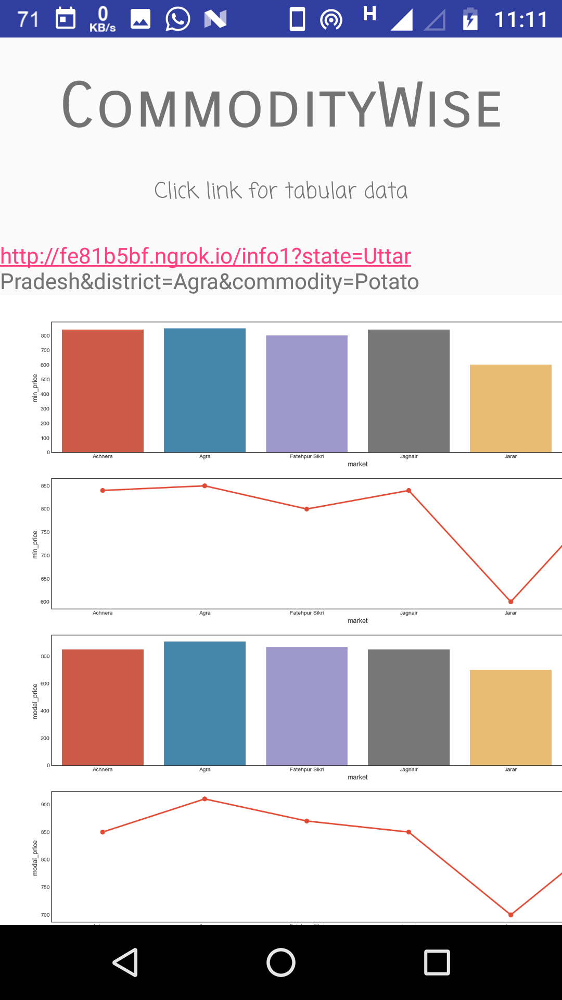
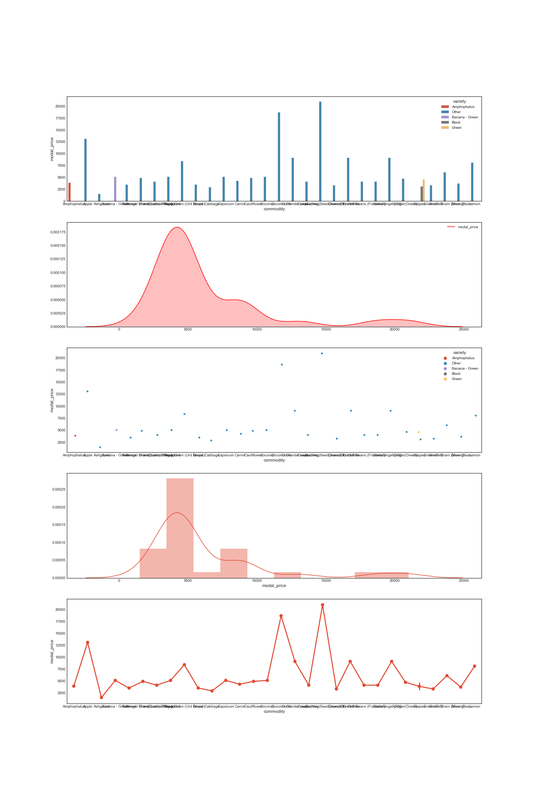

# Agricultural-Price-Prediction-and-Visualization-on-Android-App

 
   

**I have used data provided by open government site data.gov.in, which updates prices of market daily. **

**Working Interface Details:
We have provided user choice to see current market prices based on two choices: market wise or commodity wise use increase assesibility options.**

**Market wise: 	User have to provide State,District and Market name and then select market wise button.
		          Then user will be shown the prices of all the commodities present in the market in graphical format, so that he can analyse       the rates on one scale. 
		          This feature is mostly helpful for a regular buyer to decide the choice of commodity to buy.
		          He is also given feature to download the data in a tabular format(csv) for accurate analysis.**

**Commodity Wise: 	User have to provide State,District and Commodity name and then select Commodity wise button.
		              Then user will be shown the prices of all the markets present in the region with the commodity in graphical format, so that he can analyse the cheapest commodity rate. This 
		              feature is mostly helpful for wholesale buyers. 
		              He is also given feature to download the data in a tabular format(csv) for accurate analysis.**

**On the first activity user is also given forecasting choice. It can be used to forecast the wholesale prices of various commodities at some later year.
Regression techniques on timeseries data is used to predict future prices.
Select the type of item and click link for future predictions.**

**There are 3 java files Forecasts, DisplayGraphs, DisplayGraphs2 ..... Please change the localhost "server_name" at time of testing as the server name changes each time a new server is made.**

**Things Used:
We have used pandas , numpy , scikit learn , seaborn and matplotlib libraries for the same . The dataset is thoroughly analysed using different function available in pandas in my .iPynb file .
Not just in-built functions are used but also many user made functions are made to make the working smooth . Various graphs like pointplot , heat-map , barplot , kdeplot , distplot,
pairplot , stripplot , jointplot, regplot , etc are made and also deployed on the android app as well .** 
   
**To integrate the android app and machine learning analysis outputs , we have used Flask to host our laptop as the server . We have a separate file for the Flask as server.py .
 Where all the the necessary stuff of clint request and server response have been dealt with . We have used npm package ngrok for tunneling purpose and hosting .**

**A different .iPynb file is used for the time series predictions using regression algorithms and would send the csv file of prediction along with the graph to the andoid app when given a 
request. **
